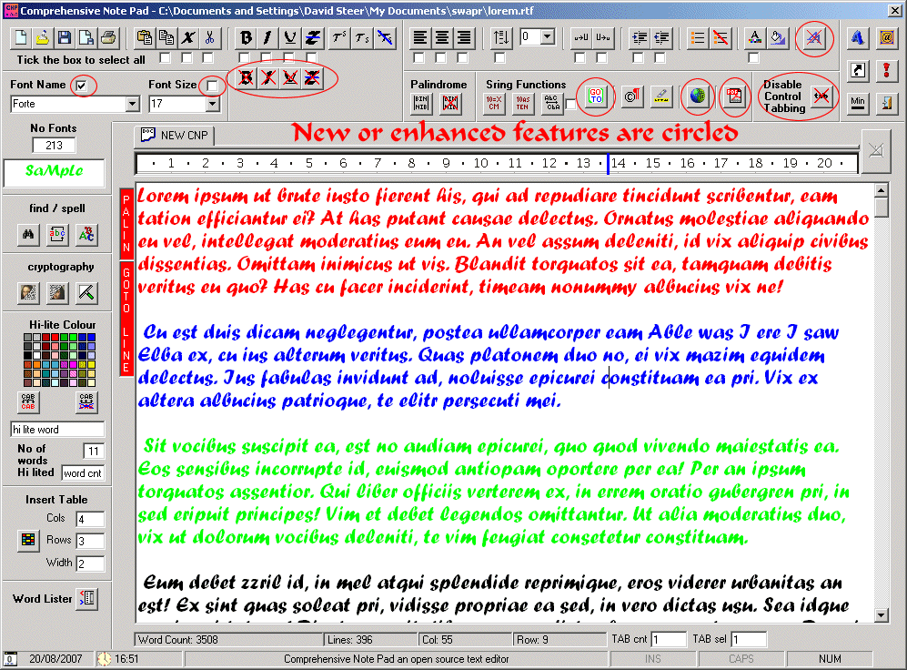



## Comprehensive Note Pad v 3\.5\.0 more finalish\!

### Description

Title: Comprehensive Note Pad v 3.5.0 more finalish !

UPDATE 20/08/07 Version 3.5.0 more finalish !

Added control tabstop enable / disable and 4 undo text formatting ( bold, underline, strike through and italic) buttons also changed font options to allow for selective font and font size changes as well as for the whole document.

----

UPDATE 17/08/07 Version 3.0.0

Barring any major bugs or any further minor revisions this application is now complete. As an exercise in code hacking along with code writing it has been a success and produced what I believe is, if not the, best of it of its type then one of the best on PSC. Thanks go to all those, both unwittingly and knowingly, that have provided code and to all those that have helped along the way

For full changes &amp; credits see readme or change log docs

16/08/07

Added Paras Chopra&#8217;s basic PDF conversion form and textbox buffer

14/08/07

Added Tom Moran's Url (web address) highlighting function and added the web page launch button and goto line functions

----

Most of the code is mine it has just been the oddities that i have had to garner along with some hints from others' code on psc along the way

This code is open source change it, bend it, do what u will with it just give credit where credit is due.

and if you like it vote for it!

all constructive criticism welcome!

regards caver dave
 
### More Info
 
Text editor

none known

             |
---                |---
**Submitted On**   |2007-08-20 16:45:18
**By**             |[caver dave](https://github.com/Planet-Source-Code/PSCIndex/blob/master/ByAuthor/caver-dave.md)
**Level**          |Intermediate
**User Rating**    |4.9 (73 globes from 15 users)
**Compatibility**  |VB 6\.0
**Category**       |[Complete Applications](https://github.com/Planet-Source-Code/PSCIndex/blob/master/ByCategory/complete-applications__1-27.md)
**World**          |[Visual Basic](https://github.com/Planet-Source-Code/PSCIndex/blob/master/ByWorld/visual-basic.md)
**Archive File**   |[Comprehens2080198202007\.zip](https://github.com/Planet-Source-Code/caver-dave-comprehensive-note-pad-v-3-5-0-more-finalish__1-67865/archive/master.zip)

### API Declarations

lots see code

